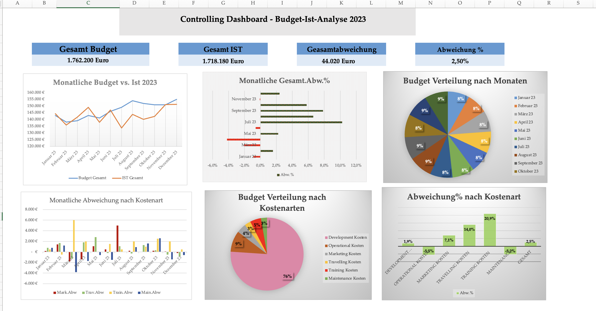
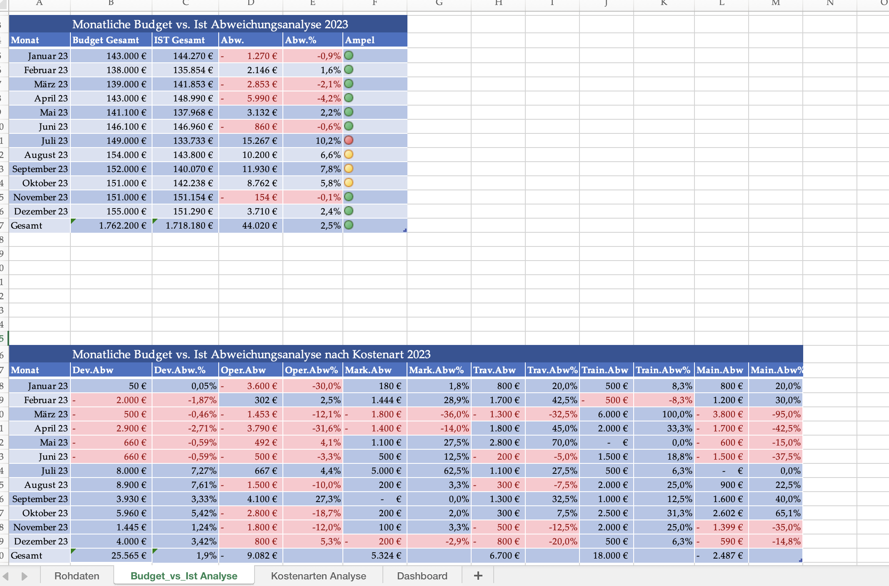
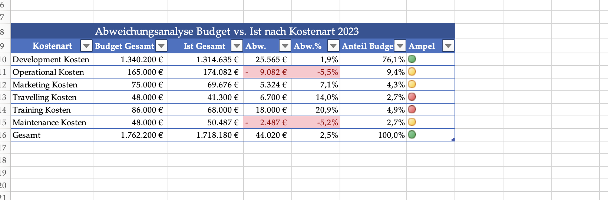
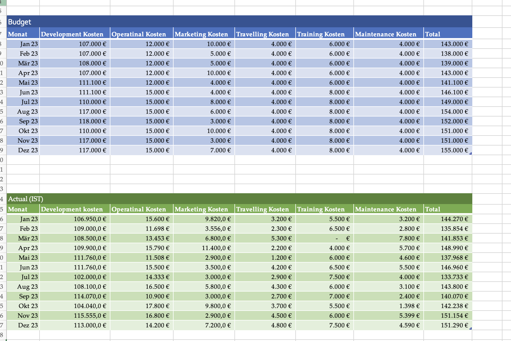

# 📊 Financial Controlling Dashboard – Variance Analysis

Financial controlling dashboard analyzing budget vs. actual costs with variance analysis, KPI tracking, and data visualization based on a Kaggle dataset.

---

## 📁 Data Source
- Kaggle dataset  
- Monthly financial data for 2023  
- Cost categories: Development, Operational, Marketing, Travelling, Training, Maintenance  

---

## 📊 Key Features

- Budget vs. Actual comparison  
- Variance analysis (€ and %)  
- KPI tracking (Total Budget, Actual, Deviation, %)  
- Cost analysis by category  
- Monthly performance analysis  

---

## 📊 Dashboard Overview

---

## 📈 Monthly Variance Analysis

---

## 📊 Variance by Cost Type

---

## 📁 Raw Data

---

## 💡 Business Value

- Identifies cost deviations and trends  
- Highlights key cost drivers  
- Supports financial decision-making  
- Improves budget control  

---

## 👤 Author
Naoual Elmossaaid
